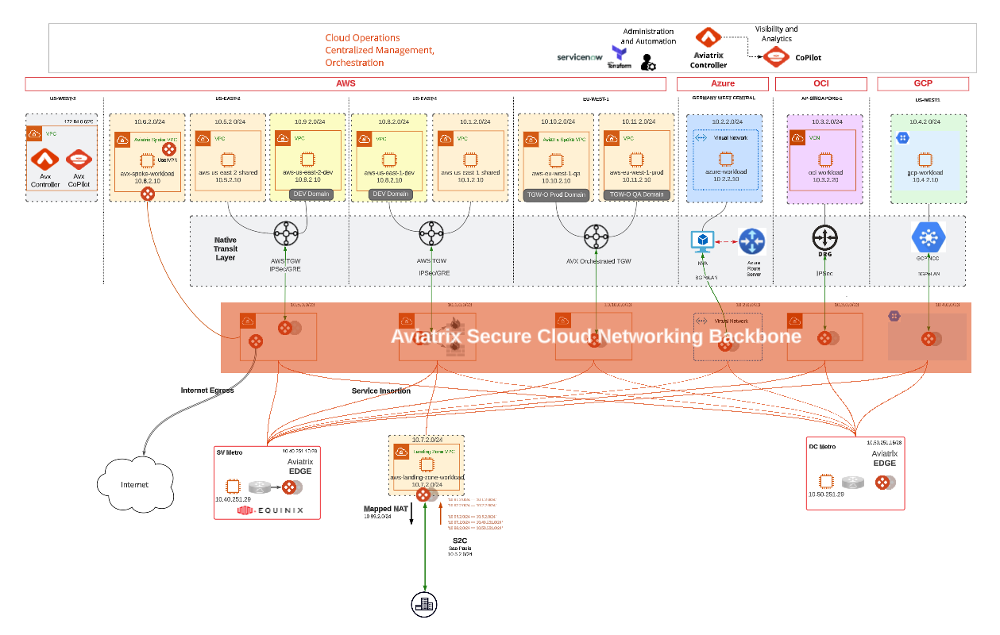

# aviatrix-backbone-demo-environment

 Terraform code for building the Aviatrix Backbone Demo Environment

## Description

Full, end-to-end, terraform for building the Aviatrix backbone demo environment.

The terraform is broken into 3 separate states:

- controller
- controller configuration
- airspace

The airspace state is sits at the root of the repository.

### Controller

Executed from within the `controller` folder, this example code deploys an Aviatrix Controller and Copilot in AWS behind an alb with integrated WAF. ACM certificates are used to provide https access terminated at the alb (and re-encrypted between alb and controller/copilot). ACM certificate generation and DNS are outside the scope of this code.

### Controller configuration

Once the Aviatrix Controller and Copilot are deployed, this code is used to configure base settings and initialization configuration, including CSP account onboarding, for each system. Once applied the control plane is complete and ready to being building out multicloud airspace architectures.

### Airspace

For the purpose of this demo environment, the four primary CSPs are used - AWS, Azure, GCP, and OCI. The Aviatrix Secure Cloud Networking Backbone is deployed with the Aviatrix terraform provider, while connectivity into workload VPC|VNet|VCNs is achieved with each respective CSP's terraform provider. This has been segregated into separate tf files per cloud:

- [csp_aws_tgw.tf](/airspace/csp_aws_tgw.tf)
- [csp_azure_ars.tf](/airspace/csp_azure_ars.tf)
- [csp_gcp_ncc.tf](/airspace/csp_gcp_ncc.tf)
- [csp_oci_drg.tf](/airspace/csp_oci_drg.tf)

### Workloads

Each `spoke` network has a ubuntu image generating traffic to populate netflow with meaningful example data.

## Diagram

## Assumptions

- Palo Alto bootstrap configuration needs to exist in a folder named `palo_bootstrap` in the root execution directory.
- The Aviatrix edge qcow2 must exist in the `/airspace` directory.
